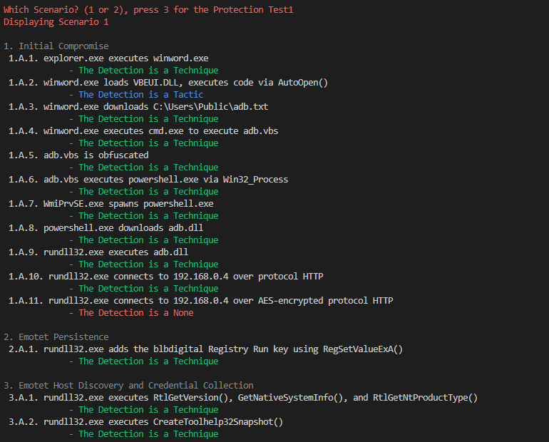

# MITRE_Compare | ATT&CK Evaluations Analysis Tool: Wizard Spider + Sandworm
Basically something I made to deal analyze the various differences and to quickly get a overview..

Interactive tool for visualizing cybersecurity vendor performance in MITRE ATT&CK Evaluations against Wizard Spider and Sandworm, showcasing detection capabilities and protection efficacy via the CLI.

## Overview
This Python script is designed to facilitate the interactive selection and analysis of cybersecurity vendors based on their performance in the MITRE ATT&CK Evaluations, specifically focusing on the Wizard Spider and Sandworm threat groups. By parsing and presenting data from structured JSON files, the tool offers detailed insights into how various vendors detect and protect against sophisticated cyber threats. It highlights key aspects such as analytical coverage, telemetry coverage, visibility, and the effectiveness of protection tests, all within the context of these high-profile threat actor simulations. The script's objective is to provide users with a comprehensive understanding of each vendor's capabilities in the face of advanced persistent threats (APTs) represented by Wizard Spider and Sandworm, underlining the critical elements of cybersecurity readiness and resilience.

## Features
- Interactive menu for selecting among 30 cybersecurity vendors evaluated in the context of MITRE ATT&CK Evaluations for Wizard Spider and Sandworm.
- Detailed presentation of vendor performance, categorized into detections by technique, tactic, general detections, telemetry, and protection tests outcomes.
- Utilization of Colorama for enhanced readability, with specific colors highlighting crucial information, facilitating an intuitive understanding of complex data.
- Option for users to delve into detailed overviews, including specific detection scenarios and protection test results, for an in-depth analysis of each vendor's strengths and weaknesses against specfic steps/scenarios.

## Preview



## Prerequisites
Ensure you have the following installed to use this script:
- Python 3.x
- Colorama package

## Usage
0. Clone the Repo with `git clone  https://github.com/NEEDGITGOOD/MITRE_compare.git` from your command line.
1. `cd MITRE_compare` 
2. Run `python mitre_compare.py`
3. Follow the prompts to select a vendor and explore their evaluation results against Wizard Spider and Sandworm.

## JSON File Structure
JSON File Structure is available to download at the MITRE Site, it has the following Logic (the most important things):
```json
{
  "Participant_Name": "Vendor Name",
  "Adversaries": [
    {
      "Evaluation_Year": "Year",
      "Aggregate_Data": {
        "Aggregates": {
          "Total_Substeps": ...,
          "Total_Detections": ...,
          "Total_Alerts": ...,
          "Analytic_Detections": ...,
          "Telemetry_Detections": ...,
          "Analytic_Coverage": ".../...",
          "Telemetry_Coverage": ".../...",
          "Visibility": ".../..."
        }
      },
      "Detections_By_Step": {
        "Scenario_1": {
          "Steps": [...]
        },
        "Scenario_2": {
          "Steps": [...]
        }
      },
      "Protections": {
        "Protection_Tests": [...]
      }
    }
  ]
}
```


## License
This project is released under the [MIT License](LICENSE).
